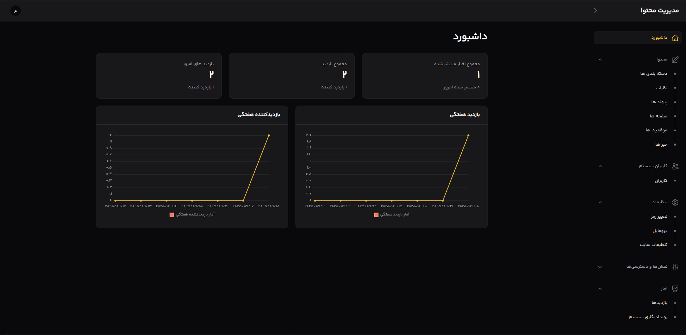

    
    <h3>Laravel Base Free News CMS</h3>
    

    سی ام اس رایگان ویژه پایگاه ها و سایت های خبری
    

## درباره سی ام اس رایگاخ خبری
این سیستم جامع مدیریت محتوا، به صورت اختصاصی برای مدیریت پایگاه های خبری فارسی زبان طراحی شده است. این سی ام اس به صورت رایگان و متن باز در دسترس می باشد. استفاده از این سی ام اس بسیار راحت بوده و محیط آن کاربرپسند طراحی شده است. تیم توسعه دهنده این سی ام اس به صورت مرتب توسعه های لازم را انجام داده و در اختیار استفاده کنندگان قرار می دهند.

## فهرست مطالب

- [معرفی](#معرفی)
- [ویژگی‌های کلیدی](#ویژگی‌های-کلیدی)
- [پیش‌نیازها](#پیش‌نیازها)
- [روش‌های نصب](#روش‌های-نصب)  
  - [نصب دستی](#نصب-دستی)
  - [نصب با Docker](#نصب-با-docker)
- [پیکربندی](#پیکربندی)
  - [تنظیمات پایگاه داده](#تنظیمات-پایگاه-داده)  
- [به‌روزرسانی](#به‌روزرسانی)
- [توسعه](#توسعه)
- [مشارکت](#مشارکت)
- [حمایت مالی](#حمایت-مالی)
- [لایسنس](#لایسنس)

